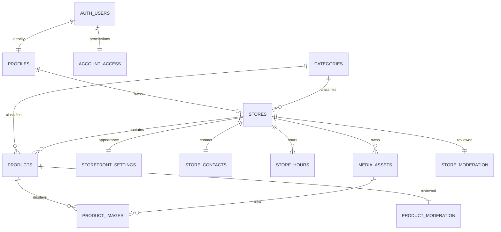
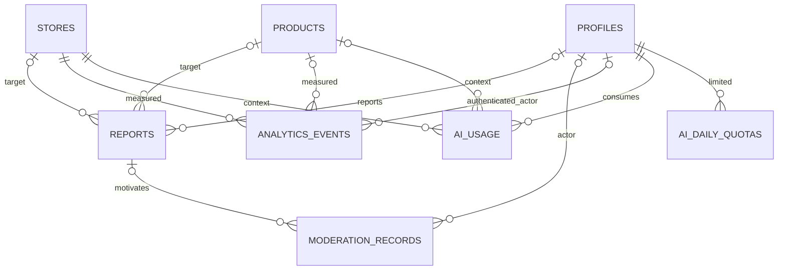

# Database schema and access model

Status update: M2 SQL migrations and PostgreSQL RLS tests are now implemented; see `08-m2-handoff.md`. Hosted Supabase execution and generated project types remain pending. The model below is the agreed design baseline; migration files are the executable schema.

Conventions: UUID primary keys use `gen_random_uuid()` unless noted; `created_at` and `updated_at` are `timestamptz NOT NULL DEFAULT now()` on mutable tables. Required values below are NOT NULL unless marked `?`. FK columns indexed. Monetary amounts are integer minor units, never floating point. All public tables have RLS enabled and explicit grants; private tables are not exposed through PostgREST. A `private` schema contains policy helpers/privileged internals.

## Entities (columns and constraints)

| Table | Columns / constraints |
|---|---|
| `profiles` | `id UUID PK FK auth.users ON DELETE CASCADE`, `display_name varchar(120)`, `created_at`, `updated_at`. No role, phone or suspension flag that a seller can write |
| `private.account_access` | `user_id UUID PK FK auth.users`, `role enum(seller,admin) DEFAULT seller`, `status enum(active,restricted,suspended) DEFAULT active`, `reason text?`, `changed_by UUID? FK auth.users`, timestamps. Provisioned by secure signup trigger; role/status only changed by audited admin operation |
| `categories` | `id`, `slug varchar(80) UNIQUE`, `name varchar(80)`, `sort_order int DEFAULT 0`, `active boolean DEFAULT true`, timestamps; flat taxonomy for MVP, service-managed |
| `stores` | `id`, `owner_id UUID UNIQUE FK profiles`, `slug varchar(80) UNIQUE`, `name varchar(120)`, `description varchar(2000) DEFAULT ''`, `category_id UUID? FK categories`, `city varchar(80)`, `country_code char(2) DEFAULT 'ZM' CHECK = 'ZM'`, `publication enum(draft,published,archived) DEFAULT draft`, `onboarding_step smallint CHECK 1..4`, `submitted_at timestamptz?`, timestamps. Slug lowercase `[a-z0-9]+(-[a-z0-9]+)*`, minimum 3 characters, reserved names rejected. Owner immutable; one store per seller |
| `storefront_settings` | `store_id UUID PK FK stores ON DELETE CASCADE`, `tagline varchar(160) DEFAULT ''`, `theme enum(forest,earth,ochre) DEFAULT forest`, `button_style enum(rounded,square)`, `logo_asset_id UUID?`, `cover_asset_id UUID?`, timestamps. Composite media FKs enforce asset/store consistency |
| `store_contacts` | `store_id UUID PK FK stores ON DELETE CASCADE`, `whatsapp_e164 varchar(16) CHECK ^\+[1-9][0-9]{7,14}$`, `public_email varchar(254)?`, `pickup_note varchar(1000) DEFAULT ''`, `delivery_note varchar(1000) DEFAULT ''`, `timezone text DEFAULT 'Africa/Lusaka'`, timestamps. Public contact fields explicitly opt-in; no private account email joins |
| `store_hours` | `id`, `store_id FK stores ON DELETE CASCADE`, `weekday smallint CHECK 0..6`, `closed boolean`, `opens time?`, `closes time?`, `UNIQUE(store_id,weekday)`, CHECK closed implies both times null, otherwise closes > opens. No overnight schedule in MVP |
| `products` | `id`, `store_id UUID FK stores`, `category_id UUID FK categories`, `slug varchar(140)`, `title varchar(120)`, `description varchar(5000)`, `price_minor bigint? CHECK >=0 AND <=100000000000`, `currency char(3) CHECK = 'ZMW'`, `availability enum(available,unavailable,made_to_order)`, `publication enum(draft,published,archived) DEFAULT draft`, `marketplace_visible boolean DEFAULT true`, `published_at timestamptz?`, timestamps; `UNIQUE(store_id,slug)`, `UNIQUE(id,store_id)`. Null price is “Ask for price”; zero is explicitly free, never confused with null |
| `media_assets` | `id`, `store_id UUID FK stores`, `uploaded_by UUID FK profiles`, `storage_path text UNIQUE`, `mime_type enum(image/jpeg,image/png,image/webp)`, `bytes int CHECK 1..5242880`, `width int`, `height int`, `status enum(pending,ready,rejected)`, timestamps, `UNIQUE(id,store_id)`. Ready only after server validates and transforms bytes. Object path `<store UUID>/<asset UUID>/<variant>.<ext>` |
| `product_images` | `id`, `product_id UUID`, `store_id UUID`, `asset_id UUID`, `position smallint CHECK 0..4`, `alt_text varchar(250)`, timestamps, `UNIQUE(product_id,position)`, `UNIQUE(product_id,asset_id)`, composite FK `(product_id,store_id)` → products and `(asset_id,store_id)` → media_assets; delete cascades from product |
| `store_moderation` | `store_id UUID PK FK stores`, `status enum(pending,approved,rejected,hidden) DEFAULT pending`, `reason text?`, `reviewed_by UUID? FK profiles`, `reviewed_at timestamptz?`, `revision bigint DEFAULT 1`, timestamps. Sellers can read own status, never write it |
| `product_moderation` | Same shape keyed by `product_id UUID PK FK products`. Substantive product or associated image changes increment revision and reset approval atomically |
| `reports` | `id`, `reporter_id UUID? FK profiles ON DELETE SET NULL`, `store_id UUID? FK stores`, `product_id UUID? FK products`, `reason enum(prohibited,misleading,spam,other)`, `details varchar(2000)`, `status enum(open,reviewing,resolved,dismissed) DEFAULT open`, `assigned_to UUID? FK profiles`, `resolution varchar(2000)?`, `resolved_at timestamptz?`, timestamps; CHECK exactly one target. Anonymous reports contain no contact requirement |
| `moderation_records` | `id`, `actor_id UUID? FK profiles ON DELETE SET NULL`, `target_user_id UUID? FK profiles`, `target_store_id UUID? FK stores`, `target_product_id UUID? FK products`, `report_id UUID? FK reports`, `action varchar(50) CHECK IN allowlist`, `reason varchar(2000)`, `before_state jsonb`, `after_state jsonb`, `created_at`; exactly one target; insert-only via audited privileged operation; no secrets/PII blobs |
| `analytics_events` | `id`, `event_key UUID UNIQUE` for idempotency, `kind enum(store_view,product_view,whatsapp_click)`, `store_id UUID FK stores`, `product_id UUID?`, `actor_id UUID? FK profiles ON DELETE SET NULL`, `session_hash text?`, `referrer_host varchar(253)?`, `occurred_at timestamptz DEFAULT now()`. Composite product/store FK; store_view has no product, product_view requires product; WhatsApp may target store or product. IDs/time derived or checked on server |
| `ai_usage` | `id`, `user_id UUID FK profiles`, `store_id UUID FK stores`, `product_id UUID?`, `request_key UUID UNIQUE`, `status enum(reserved,succeeded,failed,expired)`, `provider varchar(40)`, `model varchar(120)`, `input_tokens int? CHECK >=0`, `output_tokens int? CHECK >=0`, `reserved_at timestamptz`, `completed_at timestamptz?`, `error_code varchar(80)?`; composite product/store FK. No complete prompts or provider secrets logged |
| `private.ai_daily_quotas` | Composite PK `(user_id UUID FK profiles, quota_date date)`, `reserved_count int CHECK >=0`, `limit_count int CHECK >=0`. Atomic UPSERT/reservation under lock; provider call only after success. Counts attempts, including failed calls, to cap spend. Reservations stale after timeout marked expired, not silently reused |

Lookup enums are PostgreSQL enums or CHECK-constrained values in migrations. Publication is seller intent, moderation is independent administrative permission. Product visibility in the directory additionally requires `marketplace_visible=true`; approved store-only products remain accessible from their public storefront and direct link.

## Relationships

Exactly-one report/moderation targets are CHECK constraints, not implied by the diagram. Optional product FKs never permit cross-store associations.

## RLS and grants matrix

| Data | Anonymous | Seller | Administrator |
|---|---|---|---|
| profiles | None | SELECT own; UPDATE display_name only | Minimum profile access through protected server operations |
| account_access / quota internals | None | No direct access | Private, audited operation only |
| categories | SELECT active | Same | Manage via server |
| stores/settings/contacts/hours | SELECT public store only | Own read and permitted column writes if active | Protected moderation operations |
| products/images/assets | SELECT public eligible content only | Own read and permitted writes if active | Protected moderation operations |
| moderation status | No direct table grant | SELECT own target status | Transition only via audited operation |
| reports | No direct insert/read | No raw writes; submit through guarded endpoint | Read and resolve through protected server |
| moderation_records | None | No raw access | Read only; writes from operation transaction |
| analytics_events | No direct read/write | Aggregated own metrics only, no visitor IDs | Aggregated operational metrics |
| ai_usage | None | SELECT own usage, no inserts/updates | Operational summaries |
| storage.objects | None directly | Restricted own pending-upload insert through signed token; no raw overwrite | Server lifecycle only |

RLS helpers in `private`: `is_active_user()`, `owns_store(uuid)`, `can_read_store(uuid)`, `can_read_product(uuid)`, `is_admin()`. These read account/moderation state without recursive public policies. If SECURITY DEFINER is required to inspect private tables, set `search_path=''`, fully qualify all relations, use fixed SQL, check `auth.uid()` for privileged decisions, revoke default PUBLIC EXECUTE and grant only required execution. Read-public helpers may allow null uid but return a boolean only; never expose private rows. No `user_metadata` authorization and no cached JWT-only suspension decision.

Column grants and immutability triggers prevent changing owner/store/id/approval/role. Every UPDATE policy has USING and WITH CHECK plus a matching SELECT policy. Store/product insert transaction creates pending moderation record. Publication needs complete contact/content and approved media; triggers enforce this even with direct API calls. Content edits reset moderation before commit; admin cannot approve an obsolete revision. Suspension immediately removes store/products/media from public reads and disables mutation/AI access; existing tokens do not bypass current account state.

## Storage, integrity and indexing

Private `store-media` bucket. No public raw bucket because unpublishing must hide media too. Authenticated upload sign/finalize handlers validate ownership and current restriction, enforce 5 MiB and 20 megapixel bounds, verify signature/MIME, strip EXIF and create bounded variants. Deny SVG and HTML. Proxy route rechecks public eligibility (or owner/admin) before returning bytes. M1 has no uploader; transformation runtime choice must pass Workers compatibility tests in M3. Prefer Supabase transformations where available; never rely on sharp native binaries inside Workers. Cache public media only after a defined purge mechanism; start with no-store for strict moderation correctness.

Indexes: `stores(owner_id)` via unique; stores `(publication,created_at DESC)`; products `(store_id,publication,created_at DESC,id)`, `(category_id,publication,price_minor,id)`; products GIN on generated `search_document tsvector` built from title/description (`simple` config for names); moderation `(status,updated_at)`; reports `(status,created_at)`; events `(store_id,occurred_at,kind)`, `(product_id,occurred_at)`; usage `(user_id,reserved_at)`. Add city filtering index after EXPLAIN on realistic data. Page sizes max 48; max query length 120; use bound parameters, no user-controlled SQL sort identifiers.

Events: server rejects drafts/suspended targets and excludes owner/admin traffic where identifiable. Approximate pseudonymous sessions only; no fingerprinting, raw IP, phone, full URL queries or message body stored. Bot filtering and per-session/target/time-window dedupe; click UUID prevents retries from double counting. Label rates “WhatsApp click-through rate” with denominator stated; never “orders” or “sales conversion”. Browser instrumentation can be blocked, so counts are observed events, not exact people. Retain raw events 90 days (proposed; confirm privacy policy), aggregate daily totals before deletion if needed.

## Migration and seed plan

M2: use pinned Supabase CLI `migration new` (discover current help) for identity/access, catalog/settings, moderation, events/AI, storage/RLS, then indexes/functions. Apply to clean local Supabase and replay twice using reset; generate TS types. Test anon + two real authenticated users + admin through PostgREST and Storage, not only service-role SQL. Cover attempts to rewrite owner/role/state, cross-link image IDs, read drafts, bypass suspension, resolve others' reports and race the AI quota.

Production migration seeds only the approved category taxonomy. Local seed script requires localhost Supabase URL and explicit development flag; creates clearly named TEST sellers/products, never copied to production. No default admin password and no auto-admin signup. Initial admin UUID is promoted by an owner-run, audited bootstrap command; require MFA. Account deletion archives public content immediately, purges contact/media, and follows documented retention for audit records; do not cascade away security evidence accidentally.

Billing extension is deferred: later add `billing_customers`, `subscriptions`, `billing_webhook_events`, `entitlements`, `promotions` tied to store/user; provider event ID unique for replay protection. No seller balances or sales tables.
