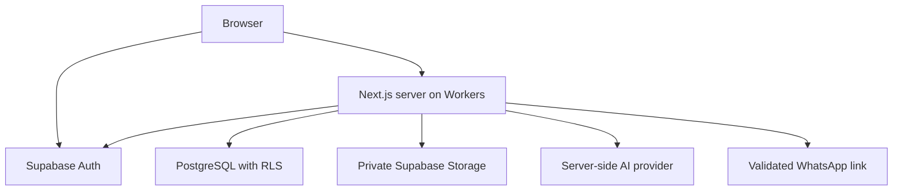

# Architecture and deployment decision

## Application

One portable Next.js App Router TypeScript application, not a static export. Public pages use Server Components for SEO. Small interactive islands handle forms/gallery/filter drawer. Server Actions implement normal mutations; Route Handlers handle event ingestion, uploads, auth callbacks and AI. Domain services live in `src/lib`; UI uses owned shadcn/ui source components, Tailwind tokens and Lucide. Database remains PostgreSQL in Supabase; Auth and private Storage use official clients.

Normal database requests carry the user's session and use RLS. A narrowly scoped server secret client is reserved for ingest, quota reservation and audited administrative transactions after explicit authorization; it is never the default database client. Sessions stored via `@supabase/ssr` cookies, verified on the server (`getUser` / validated claims as documented); layout checks improve UX but each mutation independently verifies permissions. No secrets returned in errors or logs. Auth refresh responses must preserve all cookie options and disable shared caching. Rate limits must be shared across Workers (database atomic counters or managed Cloudflare controls), never an in-memory Map.

Request flow: parse input → authenticate if required → read current restriction/role → authorize ownership → transaction/RLS → typed result → revalidate necessary public pages. Public content initially dynamic/no-store to guarantee rapid moderation removal. Add caching only with tested purge and authorization boundaries; never cache authenticated HTML, auth refresh responses or privileged queries.

## Hosting research — checked 2026-09-20

Cloudflare's current Next.js guide recommends **vinext** by default, describes it as a **beta reimplementation of the Next.js API surface**, and requires a compatibility check for production adoption. This differs from older advice that OpenNext is its default.

Decision: retain the user's requested real Next.js framework. Evaluate **OpenNext Cloudflare** as the preferred adapter because it transforms the real Next.js build. Official OpenNext docs declare Next.js 16 support, App Router, SSR, routes and Server Actions; they also list Node middleware as unsupported. Do not implement Node proxy middleware until the exact installed adapter's support is proven. Use server authorization for all protected operations regardless. M2 auth refresh implementation is an explicit adapter gate.

M1 outcome: the native Next build and OpenNext bundle build succeed. The adapter remains **provisional for deployment** because local Wrangler startup failed on this execution environment's `uv_interface_addresses` system call. No Workers HTTP, auth, Storage or deployment success is claimed. The checked-in adapter configuration is a reproducible candidate, not a production compatibility signoff.

M1 must verify the exact Next/React/adapter peer ranges, run Next build and then OpenNext build plus a local workerd smoke test before declaring adapter compatibility. If environment/tooling prevents that, record a provisional decision rather than claim deployment readiness. Cloudflare deployment itself needs credentials and is a later gate. No `@cloudflare/next-on-pages`, no static export, no switch to edge runtime just to deploy.

Sources:
- [Cloudflare Next.js guide](https://developers.cloudflare.com/workers/framework-guides/web-apps/nextjs/)
- [OpenNext support matrix](https://opennext.js.org/cloudflare)
- [OpenNext existing-app configuration](https://opennext.js.org/cloudflare/get-started)
- [Supabase SSR client and session guidance](https://supabase.com/docs/guides/auth/server-side/creating-a-client)
- [Supabase changelog](https://supabase.com/changelog)

The lightweight changelog.md endpoint did not load in research; the HTML changelog was consulted instead. Recheck relevant Auth/Storage/database release notes at M2; no live Supabase integration was tested in M1.

## Deployment topology

Separate Supabase projects for staging and production. Local Supabase through Docker for migrations/tests. Same schema migrations, separate secrets and media. Cloudflare Workers staging subdomain, then owner-controlled bemba.com DNS for production. Node 24 build job; lockfile and exact direct dependencies committed. `nodejs_compat` and a pinned Workers compatibility date; inspect bundle compressed size against the selected account plan.

Preview deployment: noindex on every page and response, protected staging if necessary; no production keys. Production: custom domain, HTTPS, Auth redirect allowlist, SMTP, MFA for admin, database backup/restore drill, migration rollback plan, error logs without secrets, usage budgets. Migration steps are additive; snapshot database before destructive updates. Code rollback does not reverse SQL automatically.

Image handling: Supabase remains canonical private storage. Use approved bounded renditions through authorization-aware media route; no arbitrary remote image URL proxy. A later Supabase transform / Cloudflare Images decision depends on plan and strict moderation behavior. SSR metadata per public product/store, canonical slug redirect, sitemap includes only approved published entities, Product schema only with truthful price/availability; never fake aggregateRating, delivery guarantee or purchase action.

## Portability

No Lovable runtime, no proprietary database abstraction, no Cloudflare D1 replacement. Native Next `npm run build && npm start` stays available for a VPS/container fallback. Keep business logic free of Cloudflare imports. Export PostgreSQL schema/data and private objects with separate backup procedures. Git source, lockfile, migrations, config templates and runbooks belong to the project owner; no dependency on this chat for deployment.
